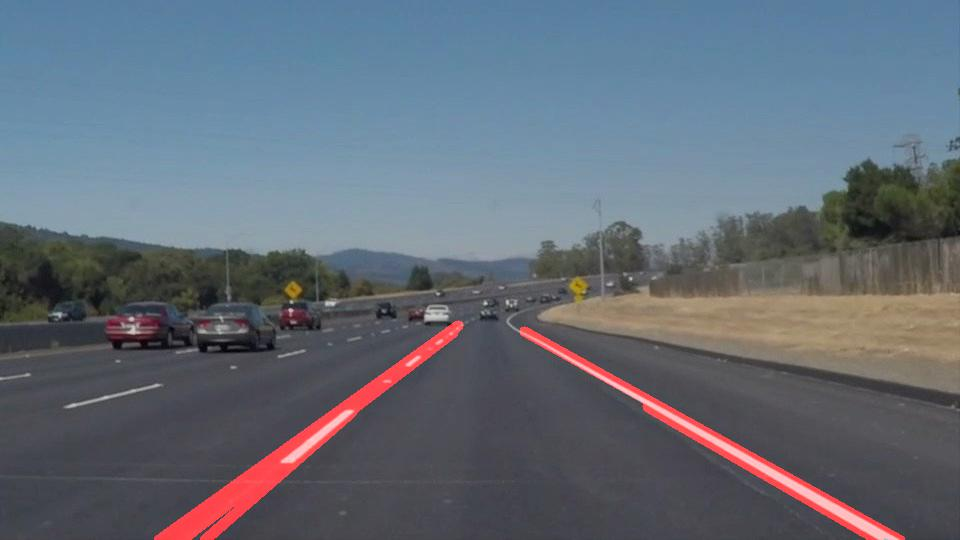
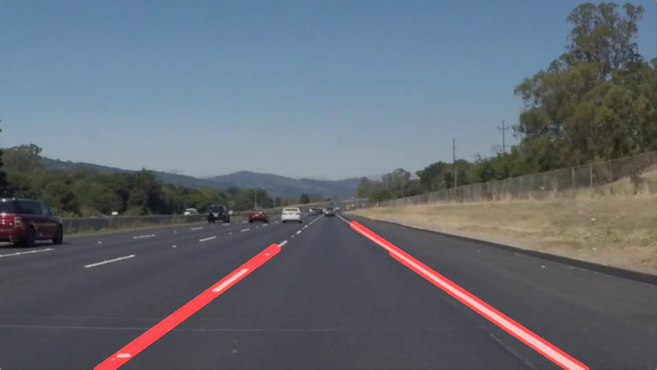
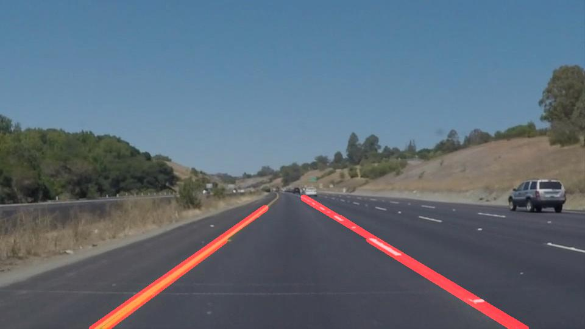
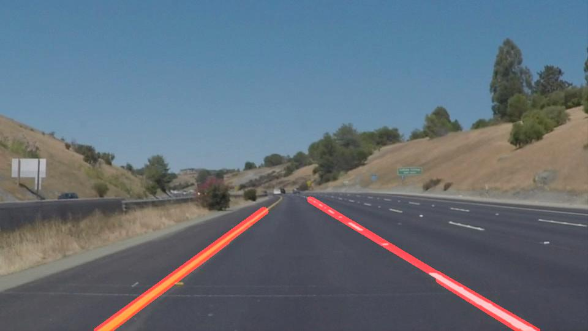
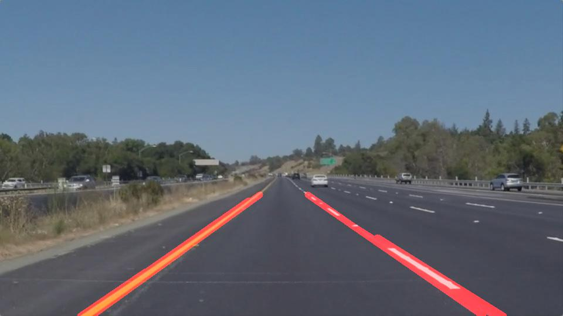
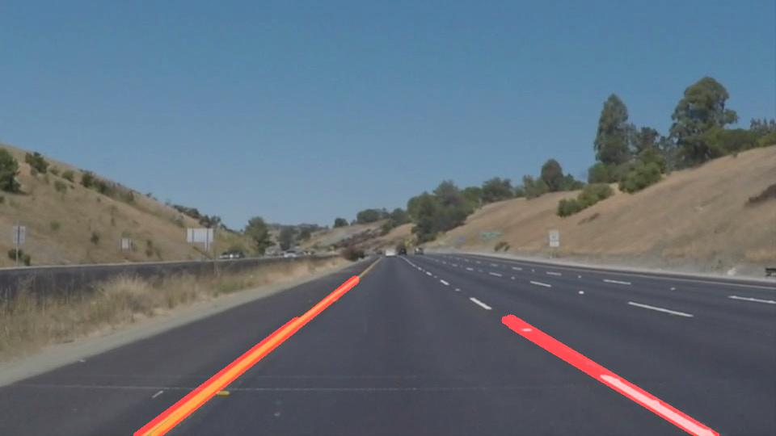

# **Finding Lane Lines on the Road** 

## Introduction

The goals / steps of this project are the following:
* Make a pipeline that finds lane lines on the road
* Reflect on your work in a written report

The code can be found in the file P1.ipynb. And the reflect is shown as following.

---

## Reflection

### 1. Description of my pipeline. 

My pipeline is put in the for-loop, which is for iterating through all images. All images are dealt with 6 steps: 
   
   1. **Read** the image. This is implemented by the function `imread()` and use the image file path as parameter:
   > mpimg.imread('test_images/' + image_name)
   
   1. **Convert the images to grayscale** by the helper function `grayscale(img)`, where the image will with only one color channel.
   
   1. **Gaussian blur** is applied to image to reduce the noise through the helper funciton `gaussian_blur(img, kernel_size)`.
   
   1. **Canny Edge Detection** is the algorithm to detect the edges by extract the useful structural information, which is implemented by the helper funciton `canny(img, low_threshold, high_threshold)`. By define different low threshold and high threshold, different results can be gotten.
   
   1. **Mask** step has create one polygon to select the interesting area which means the lanes in this area, and the new edges is resulted by funciton `region_of_interest(img, vertices)`.
   
   1. **Hough Transform** can help to find the lane lines by feature extraction technique. In this part, several parameters can be adjusted to get better result through the function `hough_lines(img, rho, theta, threshold, min_line_len, max_line_gap)`. 
   
   1. **Merge** inital image and lanes image using function `weighted_img(img, initial_img, α=0.8, β=1., γ=0.)` and save it to the output folder.
       
In order to merge lines which should be a single line in reality, especially for the left and right lanes, I modified the `draw_lines()` function. If two lines has two main relationship, they will be merge to one single:
   1. The slope of those two lines are closed enough. The threshold is defined by the parameter `max_error` which I give the value 0.2 in here.
   1. The distance of those two lines are closed enough. The threshold is defined by the parameter `max_pix_error` which I give the value 10 in here.

The result images are shown as following:

### 2. Potential shortcomings with my current pipeline

One potential shortcoming would be coming from the new `draw_lines()` function where the merging lines algorithm isn't so suitable, there must be some situation cannot be coverd. For example, some lanes could be deleted if the threshold for slope and distance are not suitable. And some other lines are not be merged to one when they should.

Another shortcoming could be in the parameters setting for the *Hough Transform*. The result is not so satisfied, such as the result for the challenge video.

Third shortcoming coming from the setting of masked which is fixed in one area. There maybe some dead angle when the car are turning or there are lots of curve lanes.

### 3. Possible improvements to my pipeline

For the `draw_lines()` function, one better algorithm should be studied and implement. 

Another potential improvement for *Hough Transform* could be to adjusted the parameters or try other algorithms.

For the third shortcoming, one adapted method or algorithm should be researched and implemented for the mask area.